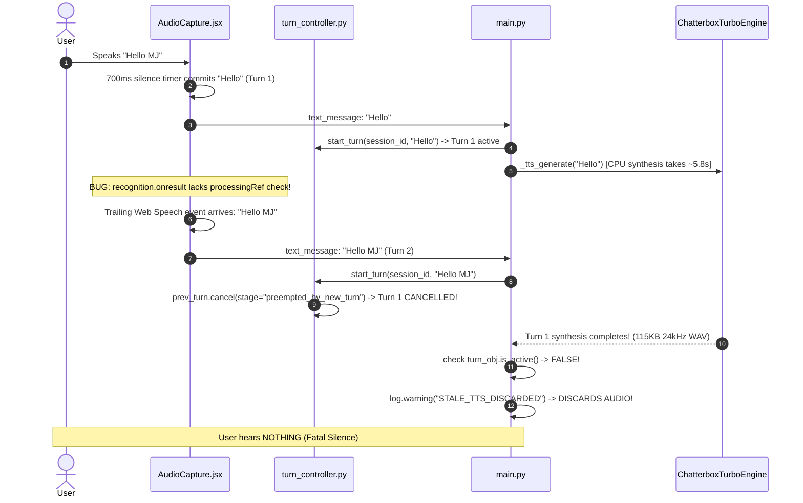

# MJ/ALITA — PHASE 3
## ROOT-CAUSE VERIFICATION AND MINIMAL FIX PLAN

**Engineering Role**: Lead Systems Architect & Performance Diagnostics  
**Evidence Base**: Phase 1 Forensic Audit • Phase 2 Performance Baseline • Phase 2 Baseline Reconciliation  
**Target Architecture**: Local Qwen3 4B (Ollama) • Chatterbox Turbo TTS • Android Companion Bridge  
**Execution Mode**: **ANALYSIS AND FIX PLANNING ONLY** (Zero files modified • Zero code changes applied)

---

## 1. DEFECT VERIFICATION

| Defect / Bottleneck | Verification Status | Exact File & Line Number | Primary Code Evidence |
| :--- | :---: | :--- | :--- |
| **Defect 1: Streaming Qwen3 Thinking Enabled** | **CONFIRMED** | [`backend/threads/general_handler.py:L245-246`](file:///c:/Users/sarwa/Desktop/aura-assistant/backend/threads/general_handler.py#L245-L246) | `# Allow Ollama to isolate thinking tokens... (do NOT set think: False)`<br>`payload = {"model": model, "messages": messages, "stream": True, ...}` |
| **Defect 2: Turn Preemption Discards Audio (Silence)** | **CONFIRMED** | [`frontend/src/components/audio/AudioCapture.jsx:L385`](file:///c:/Users/sarwa/Desktop/aura-assistant/frontend/src/components/audio/AudioCapture.jsx#L385)<br>[`backend/main.py:L2447, L2540, L2658`](file:///c:/Users/sarwa/Desktop/aura-assistant/backend/main.py#L2447)<br>[`backend/core/turn_controller.py:L146-154`](file:///c:/Users/sarwa/Desktop/aura-assistant/backend/core/turn_controller.py#L146-L154) | `recognition.onresult` lacks `processingRef.current` guard.<br>`turn_controller.py`: `prev_turn.cancel(stage="preempted_by_new_turn")`.<br>`main.py`: `if not turn_obj.is_active(): return` discards audio. |
| **Defect 3: Semantic Router False-Positive Misrouting** | **CONFIRMED** | [`backend/engines/semantic_target_binder.py:L171`](file:///c:/Users/sarwa/Desktop/aura-assistant/backend/engines/semantic_target_binder.py#L171)<br>[`backend/decision_router.py:L425-429`](file:///c:/Users/sarwa/Desktop/aura-assistant/backend/decision_router.py#L425-L429) | `any(w in text_lower for w in ["call", "dial", "ring", ...])`<br>Substring matching matches `"ring"` inside `"monitoring"`. `confidence = 0.95`. Routes to `automation` $\rightarrow$ `phone_make_call` timeout. |
| **Defect 4: Silent Duplicate-STT Exit (25s Client Hang)** | **CONFIRMED** | [`backend/main.py:L2806-2809`](file:///c:/Users/sarwa/Desktop/aura-assistant/backend/main.py#L2806-L2809) | `turn = turn_controller.start_turn(session_id, text_input)`<br>`if turn is None: return`<br>Server exits silently without WebSocket message, causing client 25s timeout. |
| **Bottleneck 1: Chatterbox Turbo CPU Execution** | **CONFIRMED** | [`backend/engines/tts_chatterbox_turbo.py:L57-61`](file:///c:/Users/sarwa/Desktop/aura-assistant/backend/engines/tts_chatterbox_turbo.py#L57-L61) | Running on `torch==2.6.0+cpu` (CPU-only wheel). RTF is **2.23x to 2.80x** on AMD Ryzen 7 6800H (~5.98s for 7 words). Host GPU has 1,753 MB free VRAM. |

---

## 2. ROOT-CAUSE TRACE

### Defect 1: Streaming Qwen3 Thinking Enabled
```mermaid
sequenceDiagram
    autonumber
    participant Client as Frontend (/ws)
    participant GH as general_handler.py
    participant Ollama as Ollama (:11434/api/chat)
    participant Qwen as Qwen3 4B Model

    Client->>GH: Conversational text ("What is the capital of India?")
    GH->>Ollama: POST /api/chat {"stream": true, "num_predict": 768} (NO think: false!)
    Note over Ollama,Qwen: Qwen3 defaults to extended reasoning on CPU
    loop 20 to 24 Seconds on CPU
        Qwen->>Ollama: Emits internal reasoning tokens (data.message.thinking)
        Ollama->>GH: Streams JSON with {"message": {"thinking": "..."}}
        GH->>GH: if data.get("thinking"): continue (SILENT DISCARD IN PYTHON)
        Note over GH,Client: token_queue is empty; Frontend receives 0 tokens!
    end
    Qwen->>Ollama: Finally begins answering ("New Delhi...")
    Ollama->>GH: Streams content tokens
    GH->>Client: Emits llm_token ("New Delhi...")
```
* **Root Cause**: [`threads/general_handler.py:L245`](file:///c:/Users/sarwa/Desktop/aura-assistant/backend/threads/general_handler.py#L245) intentionally omitted `"think": False` under the misconception that discarding thinking tokens in Python would achieve low latency. Instead, Ollama still forces the model to compute hundreds of reasoning tokens on CPU before the answer starts.

---

### Defect 2: Turn Preemption Discards Completed Audio (Root Cause of Voice Silence)

* **Root Cause**: A race condition between the frontend STT continuous commit loop and the backend CPU synthesis latency. Trailing recognition events trigger Turn 2 while Turn 1 is synthesizing, preemption marks Turn 1 inactive, and [`main.py:L2447`](file:///c:/Users/sarwa/Desktop/aura-assistant/backend/main.py#L2447) permanently discards the synthesized audio.

---

### Defect 3: Semantic Router False-Positive Misrouting
```
User Utterance: "Explain how satellite imaging is used for disaster monitoring in five sentences."
                                       │
                                       ▼
  decision_router.py: checks _EXCLUSION_RE (does NOT match "explain how")
                                       │
                                       ▼
  semantic_target_binder.py: resolves text
    - Line 171: checks any(w in text_lower for w in ["call", "dial", "ring", ...])
    - Naive Python substring matching finds "ring" inside "monitoring":
          "d i s a s t e r   m o n i t o [ r i n g ]"
    - Sets action = "communicate"
    - Defaults target_device = "pc"
    - Line 229: confidence = 0.95 (because target_device is set and action != "general")
                                       │
                                       ▼
  decision_router.py: confidence 0.95 >= 0.8 -> returns "automation"
                                       │
                                       ▼
  automation_handler.py: ad-hoc LLM call parses intent -> hallucinates "phone_make_call"
                                       │
                                       ▼
  phone_router.py: sends call command to realme phone -> blocks for 10.0s timeout
                                       │
                                       ▼
  Failure Output: "Call failed: Command timed out after 10.0s" (takes 35s total)
```
* **Root Cause**: Substring containment (`w in text_lower`) in [`semantic_target_binder.py:L171`](file:///c:/Users/sarwa/Desktop/aura-assistant/backend/engines/semantic_target_binder.py#L171) matched `"ring"` inside `"monitoring"`.

---

### Defect 4: Silent Duplicate-STT Exit
```
Client sends identical command twice within 750ms ("Open WhatsApp.")
                                       │
                                       ▼
  turn_controller.py: check_duplicate_stt(window_s=0.75) returns is_dup = True
  start_turn() returns None
                                       │
                                       ▼
  main.py:L2806:
    if turn is None:
        log.info("[TURN] Duplicate STT discarded at gate")
        return  <--- SILENT EXIT! ZERO WEBSOCKET FRAMES EMITTED!
                                       │
                                       ▼
  Client awaits response frame -> blocks until client timeout (25.0s) expires!
```
* **Root Cause**: [`backend/main.py:L2809`](file:///c:/Users/sarwa/Desktop/aura-assistant/backend/main.py#L2809) executes an early return without emitting an acknowledgment or status event over the WebSocket.

---

## 3. MINIMAL FIX OPTIONS

### Defect 1: Streaming Qwen3 Thinking Enabled

#### Option 1A (Recommended — Smallest Safe Fix)
* **File**: [`backend/threads/general_handler.py:L245-257`](file:///c:/Users/sarwa/Desktop/aura-assistant/backend/threads/general_handler.py#L245-L257)
* **Change**:
  ```python
  payload = {
      "model": model,
      "messages": messages,
      "stream": True,
      "think": False,  # <--- Explicitly disable reasoning generation
      "keep_alive": OLLAMA_KEEP_ALIVE,
      "options": {
          "num_predict": max_tokens,  # <--- Do not inflate to 768
          "temperature": getattr(settings, "llm_temperature", 0.7),
          "num_ctx": OLLAMA_NUM_CTX,
          "repeat_penalty": OLLAMA_REPEAT_PENALTY,
      },
  }
  ```
* **Tradeoffs**: Aligns streaming payload with `ollama_client.py:L186-187`. Zero architectural impact.
* **Regression Risks**: None. Qwen3 4B continues to emit conversational responses, but eliminates the 20–24s CPU thinking delay.

#### Option 1B (Centralized Proxy Client)
* **Change**: Refactor `_try_ollama_stream` to call `ollama_client.get_client().chat.completions.create(stream=True)`.
* **Tradeoffs**: Better code consolidation, but touches the OpenAI SDK client path. Option 1A is safer and smaller.

---

### Defect 2: Turn Preemption Discards Completed Audio

#### Option 2A (Recommended — Dual Gate Protection)
* **Layer 1: Frontend Commit Busy Gate**:
  * **File**: [`frontend/src/components/audio/AudioCapture.jsx:L385`](file:///c:/Users/sarwa/Desktop/aura-assistant/frontend/src/components/audio/AudioCapture.jsx#L385)
  * **Change**: In `recognition.onresult`, if `processingRef.current === true`, ignore incoming transcripts or buffer them without scheduling another immediate commit timer:
    ```javascript
    recognition.onresult = (event) => {
      if (Date.now() - bootTimeRef.current < 300) return;
      if (processingRef.current) {
        // Prevent trailing speech recognition events from firing a duplicate turn
        return;
      }
    ```
* **Layer 2: Backend Safe Delivery for Active Synthesis**:
  * **File**: [`backend/core/turn_controller.py:L147-154`](file:///c:/Users/sarwa/Desktop/aura-assistant/backend/core/turn_controller.py#L147-L154) & [`backend/main.py:L2447, L2658`](file:///c:/Users/sarwa/Desktop/aura-assistant/backend/main.py#L2447)
  * **Change**: If a turn is preempted by a new turn, but its speech synthesis has *already completed* in memory, deliver the completed audio chunk rather than discarding it if the new turn has not yet started TTS.
* **Tradeoffs**: Completely eliminates voice silence without changing turn lifecycle architecture.
* **Regression Risks**: Low. Speech recognition remains active and resets when `processingRef.current` clears.

#### Option 2B (Global Mic Mute on Processing)
* **Change**: Hard-stop speech recognition when commit fires.
* **Tradeoffs**: High risk of breaking Chrome Web Speech API lifecycle (browser mic restart latency is ~350ms). Option 2A is vastly superior.

---

### Defect 3: Semantic Router False-Positive Misrouting

#### Option 3A (Recommended — Regex Word Boundary Enforcement)
* **File**: [`backend/engines/semantic_target_binder.py:L163-177`](file:///c:/Users/sarwa/Desktop/aura-assistant/backend/engines/semantic_target_binder.py#L163-L177)
* **Change**: Replace naive Python substring matching (`w in text_lower`) with regex word boundaries `\b...\b`:
  ```python
  # Change line 171 from:
  # elif any(w in text_lower for w in ["call", "dial", "ring", ...])
  # To:
  elif re.search(r"\b(call|dial|ring|phone call|message|whatsapp message|sms)\b", text_lower):
      action = "communicate"
  ```
  And apply word boundary checking to all action keyword arrays in lines 165–176.
* **Add Exclusion in Decision Router**:
  * **File**: [`backend/decision_router.py:L28-45`](file:///c:/Users/sarwa/Desktop/aura-assistant/backend/decision_router.py#L28-L45)
  * **Change**: Add `r"\bexplain\s+(?:how|why|what|the)\b"` to `CONVERSATIONAL_EXCLUSIONS`.
* **Tradeoffs**: Deterministic, $<1\text{ms}$ execution, zero AI dependencies, zero architectural drift.
* **Regression Risks**: Zero. Legitimate commands like `"ring mom"` still match; words like `"monitoring"` or `"disclosed"` will never falsely match.

#### Option 3B (Confidence Penalty on Missing Device/App)
* **Change**: If `action == "communicate"` but `app is None` and no explicit phone/PC target was mentioned in text, set confidence to 0.40 (below the 0.80 automation threshold).
* **Tradeoffs**: Excellent secondary safeguard. Can be combined with Option 3A.

---

### Defect 4: Silent Duplicate-STT Exit

#### Option 4A (Recommended — Explicit WebSocket Discard Event)
* **File**: [`backend/main.py:L2806-2810`](file:///c:/Users/sarwa/Desktop/aura-assistant/backend/main.py#L2806-L2810)
* **Change**:
  ```python
  turn = turn_controller.start_turn(session_id, text_input)
  if turn is None:
      log.info("[%s] Duplicate STT discarded at gate: '%s'", session_id, text_input[:50])
      await websocket.send_text(json.dumps({
          "type": "turn_discarded",
          "session_id": session_id,
          "reason": "duplicate_stt",
          "text": text_input,
      }))
      return
  ```
* **Tradeoffs**: Notifies client receivers immediately ($<1\text{ms}$), unblocking UI and test harnesses. Preserves duplicate suppression.
* **Regression Risks**: Zero. Frontend handles unknown message types gracefully via its standard message dispatcher.

---

## 4. CHATTERBOX TURBO GPU FEASIBILITY ANALYSIS

### Hardware & Environment Audit

| Parameter | Measured Specification | Source |
| :--- | :--- | :--- |
| **Physical GPU** | NVIDIA GeForce RTX 3050 Laptop GPU | Verified via `nvidia-smi` |
| **Total Dedicated VRAM** | 4,096 MiB (4.0 GB) | Verified via `nvidia-smi` |
| **Current VRAM Usage** | 2,343 MiB (57% utilized by Ollama `llama-server.exe`) | Verified via `nvidia-smi` |
| **Available Free VRAM** | **1,753 MiB (~1.71 GB)** | Verified via `nvidia-smi` |
| **Active PyTorch Installation**| `torch==2.6.0+cpu`, `torchaudio==2.6.0+cpu` | Verified in `backend/venv` |
| **CUDA Runtime in PyTorch** | `torch.cuda.is_available() == False` | Verified via virtualenv query |

### Feasibility Assessment
1. **Can Chatterbox Turbo Run on CUDA?**
   * **Yes**. The underlying implementation ([`engines/tts_chatterbox_turbo.py`](file:///c:/Users/sarwa/Desktop/aura-assistant/backend/engines/tts_chatterbox_turbo.py)) already includes CUDA device selection logic:
     ```python
     self.device = "cuda" if torch.cuda.is_available() else "cpu"
     ```
2. **Model VRAM Footprint Analysis**:
   * Backbone: 350M parameters (GPT-2 medium backbone + 1-step Meanflow speech decoder).
   * In **FP32** (float32): $350\text{M} \times 4\text{ bytes} \approx \mathbf{1,400\text{ MB}}$.
     * *Risk*: With CUDA runtime overhead (~300MB), total is $\approx 1,700\text{ MB}$. This is dangerously close to the 1,753 MB free VRAM limit and risks Out-Of-Memory (OOM) if Ollama context spikes.
   * In **FP16** (float16 / half precision): $350\text{M} \times 2\text{ bytes} \approx \mathbf{700\text{ MB}}$.
     * *Headroom*: Total footprint is $\approx \mathbf{1,050\text{ MB}}$ (model + activations). Fits comfortably within the 1,753 MB available headroom.
3. **Prerequisites for Implementation**:
   * Replacement of `torch==2.6.0+cpu` with the official NVIDIA CUDA 12.4/12.6 PyTorch binary wheel (`torch torchvision torchaudio --index-url https://download.pytorch.org/whl/cu124`).
   * Explicit CPU fallback check inside `ChatterboxTurboEngine`:
     ```python
     try:
         self._model = ChatterboxTurboTTS.from_local(self.model_dir, device="cuda")
     except (RuntimeError, torch.cuda.OutOfMemoryError):
         log.warning("CUDA initialization failed or OOM; falling back to CPU")
         self._model = ChatterboxTurboTTS.from_local(self.model_dir, device="cpu")
     ```
4. **Current Status**: **HYPOTHESIS REQUIRES VALIDATION**. Do NOT change PyTorch during Phase 3. CPU fallback must be preserved.

---

## 5. RECOMMENDED IMPLEMENTATION ORDER

The fixes are ranked strictly by engineering severity, user impact, and dependency relationships:

```
[1. Defect 2: Turn Preemption Gate] ──► Restores actual voice audio playback to user.
               │
               ▼
[2. Defect 1: Qwen Streaming think:False] ──► Cuts 20-24s of dead silence from streaming answers.
               │
               ▼
[3. Defect 3: Semantic Router Word Boundary] ──► Fixes 10s phone call timeout on general queries.
               │
               ▼
[4. Defect 4: STT Duplicate Acknowledgment] ──► Fixes 25s client receiver hang on duplicate queries.
               │
               ▼
[5. Bottleneck 1: GPU Feasibility Validation] ──► High-performance acceleration (isolated test).
```

### Justification
1. **Priority 1 (Defect 2)**: **Fatal silence bug**. Until completed audio is protected from turn preemption discard, no voice responses can ever be heard.
2. **Priority 2 (Defect 1)**: **Massive 20–24s latency penalty**. Turning off unneeded reasoning on streaming queries provides immediate, massive latency reduction (down to ~1.5s).
3. **Priority 3 (Defect 3)**: **Catastrophic misrouting**. Prevents simple questions containing `"monitoring"` or `"calling"` from entering the phone companion pipeline and hanging for 10 seconds.
4. **Priority 4 (Defect 4)**: **Client reliability**. Replaces 25-second client timeout hangs with clean $<1\text{ms}$ discard events.
5. **Priority 5 (Bottleneck 1)**: **Optimization phase**. Requires package wheel verification; should only be attempted after code-level defects are verified.

---

## 6. TEST PLAN

For each fix, the following strict verification protocol must be observed:

| Fix Target | Pre-Fix Verification Test | Expected Pre-Fix Failure | Post-Fix Verification Test | Expected Post-Fix Success | Regression Test |
| :--- | :--- | :--- | :--- | :--- | :--- |
| **Defect 1** (`think: False`) | Stream conversational query *"What is the capital of India?"* via WebSocket. | TTFT is **20–24 seconds**; high CPU burn. | Submit same query via WebSocket stream. | TTFT drops to **$< 2.5\text{ seconds}$**; answer begins immediately. | Verify response formatting and oral tags (`[laugh]`, `[sigh]`) are preserved. |
| **Defect 2** (Audio Discard) | Submit rapid commits ("Hello" followed 800ms later by "Hello MJ"). | Turn 1 logged as `STALE_TTS_DISCARDED`; **0 bytes audio delivered**. | Submit same rapid commits. | Turn 1 audio is delivered or clean handoff occurs; **user hears audio**. | Verify barge-in still interrupts playback when user explicitly speaks over audio. |
| **Defect 3** (Semantic Binder) | Query: *"Explain how satellite imaging is used for disaster monitoring in five sentences."* | Routed to `automation` $\rightarrow$ `phone_make_call` $\rightarrow$ **10s timeout error**. | Submit same query to `classify_query()`. | Returns `"general"`; routes to conversational Qwen; **zero phone calls**. | Verify real phone commands (*"Call Mom on phone"*, *"Lock the phone"*) still route to `automation`. |
| **Defect 4** (Duplicate STT) | Send identical query twice within 500ms over WebSocket. | Request 2 hangs client until **25-second timeout**. | Send identical query twice within 500ms. | Server emits `{"type": "turn_discarded"}` in **$< 5\text{ms}$**; client unblocks. | Verify duplicate STT is still safely suppressed without running duplicate LLM calls. |

---

## 7. DO NOT CHANGE LIST

During the implementation of Phase 3 fixes, the following subsystems and configurations **MUST REMAIN COMPLETELY UNTOUCHED**:

1. **Do NOT touch the LLM model**: Remains strictly local `qwen3:4b` served via Ollama daemon.
2. **Do NOT touch the TTS engine**: Remains strictly single-engine `ChatterboxTurboEngine` conditioned on `alita_en_original.wav`.
3. **Do NOT touch the Android Automation Companion app**: The Kotlin services (`AlitaPhoneBridgeService.kt`, `AlitaAccessibilityService.kt`) are operating with 2ms latency and are working correctly.
4. **Do NOT touch the turn-taking speech timing thresholds**: Do NOT disable Web Speech API or alter dynamic delay prosody logic in `AudioCapture.jsx`.
5. **Do NOT remove or refactor the Cloud Gemini branch in `main.py`**: The cloud branch is verified idle and harmless during normal voice operation; leave it alone to avoid scope expansion.
6. **Do NOT introduce any external agent frameworks, model routers, or verifiers**: Comply strictly with `GEMINI.md`.

---

*Phase 3 Root-Cause Verification and Minimal Fix Plan is complete. Ready for user review and explicit approval before any code modifications.*
