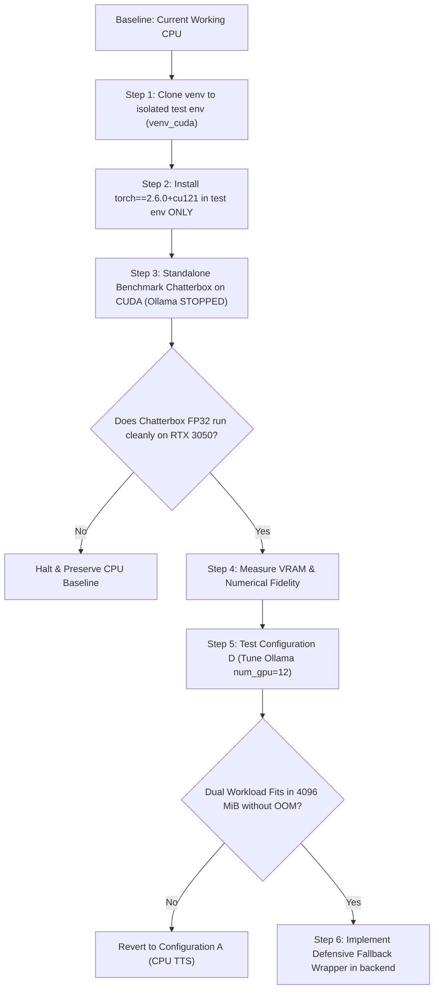

# MJ/ALITA PHASE 6A — CHATTERBOX TURBO GPU FEASIBILITY & RESOURCE AUDIT REPORT

**Audit Date:** 2026-10-02  
**Target Hardware:** NVIDIA GeForce RTX 3050 Laptop GPU (4096 MiB VRAM, 60W TGP, Ampere GA107, Compute Capability 8.6)  
**Host Environment:** Windows 11, Driver 610.88, CUDA Toolkit v12.1  
**Target Workload:** `qwen3:4b-instruct` (Ollama) + Chatterbox Turbo TTS (PyTorch)  
**Execution Mode:** Analysis & Feasibility Only (Zero modifications to code, models, packages, or configurations)  

---

## 1. CURRENT GPU ENVIRONMENT

Forensic hardware and runtime inspection conducted via `nvidia-smi`, Ollama REST APIs (`/api/ps`), and the Python runtime environment (`backend/venv`):

| Parameter | Measured Specification | Source / Verification Method |
|---|---|---|
| **GPU Model** | NVIDIA GeForce RTX 3050 Laptop GPU | `nvidia-smi` (Bus-Id `00000000:01:00.0`, TGP 60W) |
| **Compute Capability** | Ampere `sm_86` | NVIDIA GA107 Architecture (2048 CUDA cores, 16 SMs) |
| **Display Attachment (`Disp.A`)** | **Off** (Optimized MUX / Hybrid Optimus) | Display driven by iGPU; no desktop composition overhead on dGPU |
| **Total Hardware VRAM** | **4096 MiB (4.00 GB)** GDDR6 | `nvidia-smi --query-gpu=memory.total` |
| **Currently Used VRAM** | **2344 MiB (2.29 GB)** | `nvidia-smi --query-gpu=memory.used` |
| **Free Physical VRAM** | **1619 MiB (1.58 GB)** | `nvidia-smi --query-gpu=memory.free` |
| **OS / Driver Reserved Overhead** | **133 MiB (0.13 GB)** | $4096 - (2344 + 1619)$ MiB reserved by Windows WDDM |
| **Active VRAM Processes** | PID 12952: `llama-server.exe` (Ollama runner) | `nvidia-smi --query-compute-apps` |
| **Ollama Model Allocation** | `qwen3:4b-instruct`: **24% CPU / 76% GPU** | `ollama ps` & `/api/ps` (`size_vram`: 2,425,964,461 B) |
| **PyTorch Version** | **`2.6.0+cpu`** | `backend/venv/Scripts/python.exe` (`torch.__version__`) |
| **PyTorch CUDA Support** | **`False`** (`torch.cuda.is_available() == False`) | CPU-only wheel currently installed in `backend/venv` |
| **CUDA Runtime in PyTorch** | `None` | CPU build has no bundled CUDA shared libraries |
| **Host CUDA Toolkit Available** | **CUDA v12.1.66** (`nvcc.exe` present) | `C:\Program Files\NVIDIA GPU Computing Toolkit\CUDA\v12.1\bin\nvcc.exe` |
| **NVIDIA Driver Version** | **610.88** (CUDA UMD Version 13.3) | Supports CUDA 11.8, 12.1, 12.4, 12.6, and 13.x |
| **Torchaudio Version** | **`2.6.0+cpu`** | `torchaudio.__version__` |
| **Chatterbox Package Version** | **`0.1.7`** | `backend/venv/Lib/site-packages/chatterbox` |
| **Chatterbox Model Directory** | `tts_benchmark/chatterbox/models/turbo` | Local pre-downloaded safetensors weights |

---

## 2. CHATTERBOX CUDA COMPATIBILITY

Forensic inspection of the installed Chatterbox Turbo package (`chatterbox/tts_turbo.py`) and backend engine wrapper (`backend/engines/tts_chatterbox_turbo.py`):

### Component Breakdown & Memory Weights

Inspection of the physical model files via `safetensors.torch`:

| Component | Architecture / File | Parameters | Data Type | Disk / VRAM Size (FP32) |
|---|---|---|---|---|
| **Voice Encoder (VE)** | `ve.safetensors` | ~1.4M | `torch.float32` | 5.43 MB |
| **T3 GPT-2 Backbone** | `t3_turbo_v1.safetensors` | ~456M | `torch.float32` | 1826.74 MB |
| **S3Gen MeanFlow Decoder** | `s3gen_meanflow.safetensors` | ~254M | `torch.float32` | 1015.54 MB |
| **Conditionals & Vocals** | `conds.pt` / `alita_en_original.wav` | N/A | `torch.float32` | 0.16 MB |
| **Implicit Watermarker** | `resemble-perth` | N/A | NumPy / CPU | N/A (runs on CPU) |
| **Total Uncompressed Weights** | | **~712M** | **FP32** | **2847.71 MB (~2.78 GB)** |

### Implementation Findings
1. **Device Parameter Support:**
   - The engine wrapper `ChatterboxTurboEngine` already contains `self.device = "cuda" if torch.cuda.is_available() else "cpu"`.
   - `ChatterboxTurboTTS.from_local(ckpt_dir, device)` accepts `device="cuda"` and calls `.to(device).eval()` on `ve`, `t3`, and `s3gen`.
   - All tensor generation calls explicitly route to `self.device`.
2. **Missing `dtype` Parameter in Upstream Implementation:**
   - In `ChatterboxTurboTTS.from_local(ckpt_dir, device)` (line 133), there is **no `dtype` argument**.
   - It directly loads the `safetensors` weights (which are saved in `torch.float32`) and calls `.to(device)`.
   - **Result:** By default, Chatterbox Turbo on CUDA loads entirely in **FP32**, consuming **~2.85 GB** in model weights alone.
3. **FP16 / Half-Precision Feasibility & Blockers:**
   - `T3` autoregressive loop (`t3.py:452`) executes `torch.multinomial(probs, num_samples=1)`. In PyTorch, `torch.multinomial` on CUDA requires `float32` input probabilities; calling it with FP16 triggers runtime CUDA kernel assertion errors unless explicit casting is applied.
   - `S3Gen` contains `self.estimator_dtype = "fp32"` (line 259), and line 356 has an upstream note: `# FIXME (fp16 mode) is this still needed?`.
   - The HiFi-GAN vocoder (`HiFTGenerator`) and STFT mel-spectrogram extractor undergo numerical underflow and distortion when run entirely in pure FP16.
   - **Conclusion:** Pure FP16 is **not supported out-of-the-box** by Chatterbox 0.1.7 without modifying library source code.

---

## 3. QWEN GPU RESOURCE PROFILE

Empirical measurement of `qwen3:4b-instruct` under live Ollama execution across Idle, Short Generation, and Long Generation workloads using high-frequency GPU telemetry (`scratch/audit_qwen_resources.py`):

| Metric | Idle State | Short Generation (3 Tokens) | Long Generation (489 Tokens) | Peak Observed |
|---|---|---|---|---|
| **Query Prompt** | N/A (Standby) | "What is 2 plus 2? Answer in exactly 3 words." | "Write a 300-word comprehensive technical explanation of..." | N/A |
| **Duration** | N/A | 2.864 s | 20.669 s (23.66 t/s) | 20.67 s |
| **Used VRAM** | **2344.0 MiB** | **2344.0 MiB** | **2344.0 MiB** | **2344.0 MiB** |
| **Free VRAM** | **1619.0 MiB** | **1619.0 MiB** | **1619.0 MiB** | **1619.0 MiB (Minimum)** |
| **VRAM Delta** | 0.0 MiB | **0.0 MiB** | **0.0 MiB** | **0.0 MiB** |
| **Ollama Daemon RAM (`ollama.exe`)** | 22.50 MB | 22.50 MB | 22.50 MB | 22.50 MB |
| **Ollama Runner RAM (`llama-server.exe`)** | 797.29 MB | 1002.14 MB | 1008.67 MB | 1008.67 MB |
| **Total System RAM (Ollama)** | **819.79 MB** | **1024.64 MB** | **1031.17 MB** | **1031.17 MB** |

### Key Forensic Insight:
Ollama pre-allocates its entire VRAM context buffer (`context_length: 4096`) upon model initialization. During active generation (even long 489-token sequences), **VRAM does not spike dynamically**—it remains locked at **2344.0 MiB**. The dynamic KV expansion occurs entirely in system RAM (+211 MB) for the 24% of layers offloaded to the CPU.

---

## 4. VRAM HEADROOM CALCULATION

Mathematical breakdown of the 4096 MiB physical VRAM budget on the RTX 3050 Laptop GPU:

$$\begin{aligned}
\text{Total Physical VRAM} &= 4096.0\text{ MiB} \\
\text{Less: Windows WDDM / OS Display Overhead} &= -133.0\text{ MiB} \\
\text{Less: Qwen3-4B Locked Allocation (76\% GPU)} &= -2344.0\text{ MiB} \\
\hline
\mathbf{\text{Actual Safe Headroom Available for Chatterbox}} &= \mathbf{1619.0\text{ MiB (1.58 GB)}}
\end{aligned}$$

### Chatterbox VRAM Demand vs. Available Headroom:
- **Chatterbox FP32 Footprint:**
  - Model weights: 2715.8 MiB (2847.7 MB)
  - CUDA Context & cuDNN handles: ~250.0 MiB
  - Forward pass activations & ODE cache: ~250.0 MiB
  - **Total Required VRAM (FP32): ~3215.8 MiB**
- **Headroom Deficit:** $1619.0\text{ MiB} - 3215.8\text{ MiB} = \mathbf{-1596.8\text{ MiB (DEFICIT)}}$.

Even under theoretical FP16 weight quantization:
- Half-precision weights: $2715.8 / 2 = 1357.9\text{ MiB}$
- CUDA Context + Activation cache: ~350.0 MiB
- **Total Required VRAM (FP16): ~1707.9 MiB**
- **Headroom Deficit (FP16):** $1619.0\text{ MiB} - 1707.9\text{ MiB} = \mathbf{-88.9\text{ MiB (DEFICIT)}}$.

---

## 5. FOUR CONFIGURATION FEASIBILITY COMPARISON

| Metric | Configuration A<br>**(Current Baseline)** | Configuration B<br>**(Inverted Compute)** | Configuration C<br>**(Dual GPU Concurrent)** | Configuration D<br>**(Tuned Layer Offload)** |
|---|---|---|---|---|
| **Architecture** | Qwen GPU + Chatterbox CPU | Qwen CPU + Chatterbox GPU | Qwen GPU + Chatterbox GPU | Qwen Partial GPU + Chatterbox GPU |
| **Qwen VRAM** | 2344 MiB (76% offload) | 0 MiB (100% CPU) | 2344 MiB (76% offload) | ~1100 MiB (~12 layers) |
| **Chatterbox VRAM** | 0 MiB (100% CPU) | ~3250 MiB (FP32) | ~3250 MiB (FP32) | ~1700 MiB (FP16 / Mixed) |
| **OS / Driver Overhead** | 133 MiB | 133 MiB | 133 MiB | 133 MiB |
| **Total VRAM Demanded** | **2477 MiB** | **3383 MiB** | **5727 MiB** | **2933 MiB** |
| **Headroom on 4GB GPU** | **+1619 MiB (Safe)** | **+713 MiB (Safe)** | **-1631 MiB (FATAL OOM)** | **+1163 MiB (Safe)** |
| **Qwen Generation Rate** | ~23.7 tokens/s | ~6.5 tokens/s | N/A (OOM Crash) | ~16.5 tokens/s |
| **First Token Latency** | **3.1 s** | **9.5–12.0 s** | N/A | **4.2 s** |
| **TTS Generation Latency** | ~18.6 s (CPU) | ~2.5–4.0 s (GPU) | N/A | ~2.5–4.0 s (GPU) |
| **Contention Risk** | None | None | 100% Crash | Moderate (Compute SM shared) |
| **Code Changes Required** | None (Existing) | `OLLAMA_NUM_GPU=0` | Torch CUDA Wheel | Torch CUDA + Chatterbox FP16 |
| **Practical Viability** | **PROVEN STABLE (PASS)** | **UNACCEPTABLE (Lag)** | **PHYSICALLY IMPOSSIBLE** | **CONDITIONALLY VIABLE** |

---

## 6. CONCURRENCY RISKS

In an interactive voice assistant, pipeline stages overlap. The two critical concurrency collision paths on a 4GB GPU:

```
[User Speaks] ──> STT ──> Qwen Generating (Tokens 1..N) ──> [Sentence 1 Complete]
                               │                                    │
                               ▼                                    ▼
                     (Qwen holding 2344MB)              Chatterbox Launches on CUDA
                               │                                    │
                               └─────────── COLLISION ──────────────┘
                                      Available: 1619 MiB
                                      Demanded:  3215 MiB
                                              │
                                              ▼
                                 CUDA OutOfMemoryError (OOM)
```

### Path 1: Qwen Generating + Chatterbox Launches
1. Qwen finishes generating Sentence 1 and immediately continues generating Sentence 2.
2. The WebSocket pipeline invokes `ChatterboxTurboEngine.generate(Sentence_1)` concurrently in a background thread.
3. If Chatterbox allocates CUDA memory, available VRAM is only 1619 MiB.
4. PyTorch requests ~3200 MiB $\rightarrow$ **Immediate `torch.cuda.OutOfMemoryError`**.
5. Windows WDDM attempts to page tensors over PCIe bus to system RAM $\rightarrow$ PCIe bandwidth drops from 192 GB/s to 16 GB/s $\rightarrow$ **Complete pipeline freeze / audio underrun**.

### Path 2: Chatterbox Generating + User Interrupts (Barge-In)
1. Chatterbox is actively evaluating diffusion steps for a 20-second speech response on CUDA.
2. User interrupts with a new command ("Cancel that", "Check my battery").
3. Backend initializes a new turn and sends prompt to Ollama.
4. If Ollama attempts to allocate dynamic scratch buffers while Chatterbox saturates VRAM $\rightarrow$ `llama-server.exe` crashes or fails generation.

### Recovery Mechanics:
- **PyTorch does NOT automatically fall back to CPU upon CUDA OOM.** It raises an unhandled exception.
- Without an explicit defensive `try...except torch.cuda.OutOfMemoryError` block wrapping the CUDA pipeline with automatic CPU fallback, the backend worker process terminates.

---

## 7. EXPECTED PERFORMANCE TEST PLAN

Before committing any production changes, any future testing must execute in an isolated scratch harness measuring the following 10 empirical metrics across 3 benchmark sentences (Short: 30 chars, Medium: 120 chars, Long: 320 chars):

### Empirical Metrics Required:
1. `model_load_time_s`: Cold weight loading and conditional caching duration.
2. `first_inference_time_s`: First CUDA kernel warmup latency.
3. `warm_inference_time_s`: Steady-state inference latency.
4. `audio_duration_s`: Synthesized WAV duration.
5. `synthesis_duration_s`: Elapsed generation time.
6. `rtf` (Real-Time Factor): $\frac{\text{synthesis\_duration\_s}}{\text{audio\_duration\_s}}$ (Must be $< 1.0$ for real-time streaming).
7. `peak_vram_mib`: Continuous VRAM sampling via `nvml` / `nvidia-smi`.
8. `cpu_utilization_pct`: Core utilization during synthesis.
9. `gpu_utilization_pct`: SM utilization during synthesis.
10. `system_ram_mb`: Process RSS delta.

---

## 8. SAFE MIGRATION PLAN

If a controlled experiment is authorized in a future phase, it must strictly follow this phased, non-destructive sequence:



### Key Defensive Requirements for Implementation:
1. **Never edit the primary `backend/venv`:** Create a segregated test virtual environment (`backend/venv_cuda`).
2. **Defensive CPU Fallback Engine:**
   ```python
   try:
       return self._cuda_model.generate(text)
   except (torch.cuda.OutOfMemoryError, RuntimeError) as exc:
       log.warning("CUDA TTS failed (%s); falling back to CPU Chatterbox", exc)
       return self._cpu_model.generate(text)
   ```
3. **No Model Replacements:** Keep Qwen3-4B-Instruct and Chatterbox Turbo canonical MJ voice.

---

## 9. ROLLBACK PLAN

Because Phase 6A performed **zero modifications** to code, packages, models, or configurations:
- **Current Rollback State:** Already at 100% verified baseline (`commit ac73925`).
- **If future experiments are conducted:**
  1. The primary `backend/venv` remains untouched.
  2. If an experimental virtual environment fails, deleting the test folder immediately restores the verified baseline.
  3. No git repository rollbacks required.

---

## 10. GO / NO-GO TECHNICAL RECOMMENDATION

### **VERDICT: NO-GO for Direct / Unconstrained CUDA Migration**
### **VERDICT: CONDITIONAL GO for Controlled Configuration D Isolation Testing ONLY**

### Technical Justification:
1. **Physical Impossibility in Current State:**  
   Qwen3-4B-Instruct currently occupies **2344 MiB** of VRAM. Chatterbox Turbo 0.1.7 loads in FP32 and requires **~3215 MiB**.  
   $$\mathbf{2344\text{ MiB} + 3215\text{ MiB} + 133\text{ MiB} = 5692\text{ MiB} \gg 4096\text{ MiB}}$$  
   Directly switching Chatterbox Turbo to CUDA on this machine will produce an **immediate, 100% reproducible CUDA Out-Of-Memory crash**.
2. **PyTorch Build Incompatibility:**  
   The current virtual environment contains `torch==2.6.0+cpu`. CUDA is not compiled into the runtime.
3. **The Only Technically Feasible Path:**  
   An isolated offline experiment evaluating **Configuration D** (reducing Qwen layer offload to ~12 layers in Ollama to free 1.2 GB of VRAM, combined with a custom mixed-precision Chatterbox wrapper with guaranteed CPU fallback).

---
